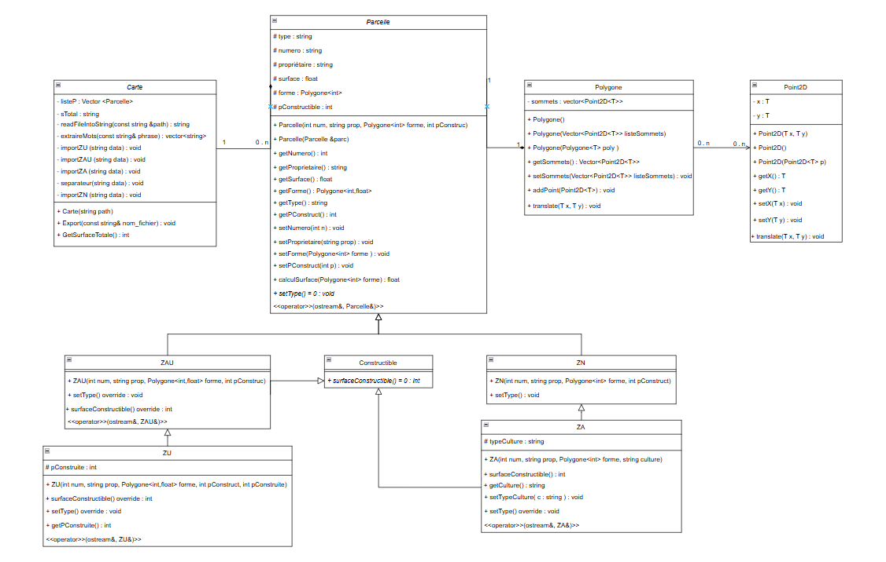

### Diagramme de classe de l'application PLU :

### Compilation et exécution du code

Pour compiler le code, il faut installer l'outil cmake sur sa machine [ _sudo apt install cmake_ ]
Il faut aussi cloner le dépôt google test à la racine du projet  [ _git clone https://github.com/google/googletest.git_ ]
Ensuite, il faut créer un dossier build à la racine du projet [ _mkdir build_ ]
Dans le dossier build, il faut exécuter la commande  [ _cmake .._ ] puis la commande [ _make_ ]
Le code est maintenant compilé s'il n'y a pas eu d'erreurs rencontrées.

Pour exécuter le main, il faut exécuté la commande [ _./src/main_ ]

Pour exécuter un test, il faut exécuté la commande [ _./tests/nomDuTest_ ]

Pour exécuter tous les tests, il faut exécuter la commande [ _./tests/all_tests_ ]

### Génération de la documentation

Pour générer la documentation, exécutez l'application Doxywizard et importer le fichier _Doxyfile_
La documentation sera générée dans le répertoire "doc".

Pour visualiser la documentation, ouvrez le fichier "index.html" dans un navigateur.

**Auteurs :** DARGERE Lucas, DELARUELLE Hugo, DEPEYRIS Julien, LAVAUX Bastien